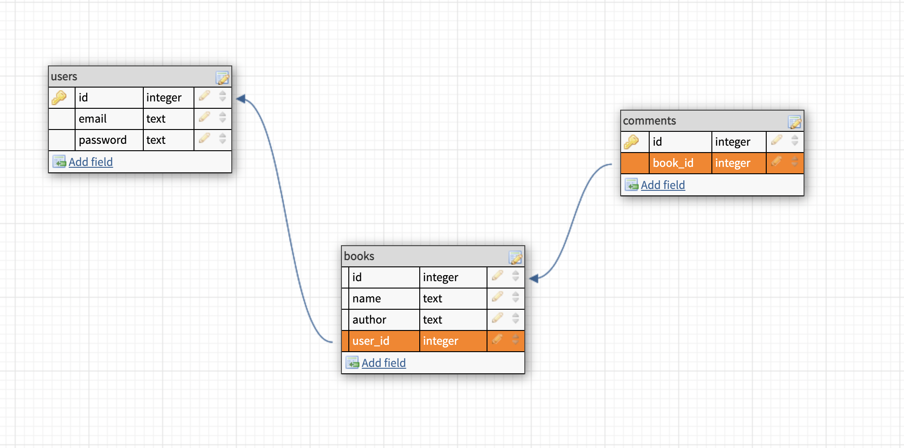

# unit4_solo_project_frontend
Final Project
## Project Name 
BoOk House
### Overview
I will built react app on frontend and flask app on my backend.
### API
https://openlibrary.org/dev/docs/api/subjects
## Description
My project's is a reading books plan app that allows you to register or login using your email and a password. You can add/cancle the books in you to do list. You also could push comments what you want to talk about this book.

## User stories
1. When I register/login I could see some recommendation books on the home page.
2. When I login with my email and password I could see my book list.
3. When I click add button the book will add in my book list.
4. I can cancle the book in my book list.
5. I can write comments about this book.
6. In the nav bar, I can click a link that will bring me to a status page.

## Routes
| http verb  | route | notes | 
| ------------- | ------------- | --- | 
|GET    | /home                                  | the home page|
|POST   | /login                          | returns the user|
|POST   | /signup                          | returns the user that got created|
|POST   | /book                           | returns the book that got created|
|GET    | /books /:userId                            | return user's shelf books|
|DELETE | /books/:bookId                     | returns the deleted book  |
|POST   | /comment                           | returns the comment that got created|
|GET   | /comments/book/:bookId                | returns the comments by bookId |
|DELETE | /comment/:commentId | disassociates a comment from a book, returns the book and comment at separate json keys |

## MVP Achievement
- Allow sign in
- Allow log in
- Allow log out
- Show all books
- Allow add book to book list
- Allow delete book from book list
- Allow create comment
- Allow delete comment
- Have links to pages disappear based on login status

## stretch goals
- Hash user password

## Wireframes

